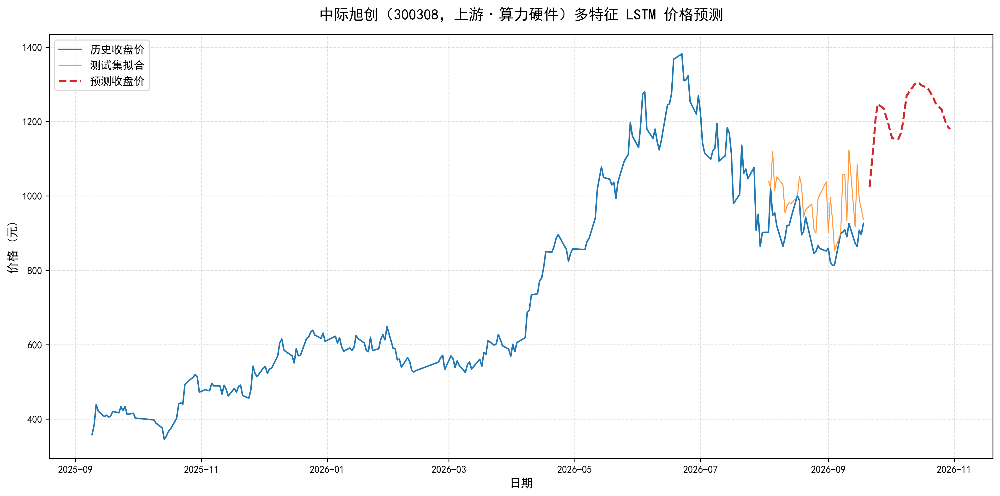

# 个股预测测试报告：中际旭创（300308）

> 测试日期：2026-09-21　|　模型：多特征 LSTM　|　标的：中际旭创（300308，上游·算力硬件/光模块）

## 1. 测试目的

验证「价格 + 产业链情绪」多特征 LSTM 在**个股级别**的预测能力。
选择中际旭创的理由：上游光模块龙头，是本轮 AI 算力行情的核心标的，股价与 AI 产业舆情关联度高，最能检验情绪特征的价值。

## 2. 数据与环境

| 项目 | 内容 |
| --- | --- |
| 行情数据 | 东方财富 K 线接口，前复权日线，250 个交易日（2025-09-09 ~ 2026-09-18） |
| 情绪特征 | 上/中/下游三环节日均情绪得分（近 30 天新闻，更早日期以 0 中性填充） |
| 新闻语料 | 双源（东方财富 + 新浪财经），全产业 1266 条 |
| 运行环境 | conda `pytorch` 环境，torch 2.5.1，CPU/GPU 自适应 |
| 随机种子 | torch / numpy 均固定为 42（结果可复现） |

期间股价从 **357.89 元**（2025-09-09）上涨至 **926.43 元**（2026-09-18），区间涨幅约 159%，呈典型强趋势 + 高波动形态。

## 3. 模型与方法

- **输入特征（5 维）**：开盘价、收盘价、upstream_情绪、midstream_情绪、downstream_情绪
- **预测目标**：收盘价（单输出）
- **网络结构**：3 层 LSTM（hidden_size=128，dropout=0.1）+ 全连接层
- **序列构造**：时间步长 15，滑动窗口监督样本
- **防数据泄漏**：先按 80/20 切分训练/测试集，MinMaxScaler 仅拟合训练集
- **训练配置**：Adam（lr=0.005），MSE 损失，batch_size=32，300 轮
- **未来预测**：递归滚动 30 步；未来日情绪特征不可知，以最近一期值填充（恒定假设）；预测日期按工作日（freq='B'）生成

## 4. 训练过程

```
Epoch [100/300], Loss: 0.003207
Epoch [200/300], Loss: 0.001357
Epoch [300/300], Loss: 0.000742
```

损失收敛稳定，无发散。训练完成后模型权重保存至 `stock_300308_model.pt`。

## 5. 评估结果

| 指标 | 数值 | 说明 |
| --- | --- | --- |
| 测试集 RMSE | **109.69** | 约占股价区间（358~926）的 12% |
| 测试集 MAE | **90.70** | 平均绝对偏差约 10% |

## 6. 未来 30 个交易日预测（2026-09-21 ~ 2026-10-30）

| 日期 | 预测收盘价 | 日期 | 预测收盘价 | 日期 | 预测收盘价 |
| --- | --- | --- | --- | --- | --- |
| 09-21 | 1024.46 | 10-02 | 1155.08 | 10-19 | 1291.06 |
| 09-22 | 1084.66 | 10-05 | 1153.76 | 10-20 | 1283.09 |
| 09-23 | 1143.74 | 10-06 | 1166.20 | 10-21 | 1273.69 |
| 09-24 | 1213.64 | 10-07 | 1191.46 | 10-22 | 1263.14 |
| 09-25 | **1247.40** | 10-08 | 1230.54 | 10-23 | 1250.17 |
| 09-28 | 1234.51 | 10-09 | 1270.16 | 10-26 | 1232.33 |
| 09-29 | 1213.35 | 10-12 | 1293.84 | 10-27 | 1212.72 |
| 09-30 | 1197.27 | 10-13 | 1301.53 | 10-28 | 1197.08 |
| 10-01 | 1173.49 | 10-14 | **1303.71** | 10-29 | 1186.51 |
| — | — | 10-15 | 1303.05 | 10-30 | 1180.08 |



## 7. 分析

**预测形态**：模型判断短期（首周）快速冲高至 1247 元，随后回落整理一周，10 月中旬再度上攻至 1303.71 元高点，月末回落收于 1180 元附近。整体呈「进二退一」的震荡上行结构，与该股过去一年的趋势特征一致。

**做得好的地方**：
- 测试集拟合（图中橙色线）基本跟上了近期震荡节奏，未出现明显滞后或发散
- 预测曲线平滑且无异常跳变，递归滚动 30 步数值稳定
- 趋势方向与产业链情绪（上游均分 +1.74，近 30 天利好占比高）定性一致

**局限与改进方向**：
- RMSE 约占股价 12%，对高波动趋势股只能把握趋势、不能把握精度
- 情绪特征仅覆盖近 30 天，训练集中 88% 的交易日情绪为 0，特征贡献被稀释
- 滚动预测采用「情绪恒定」假设，无法反映未来突发利好/利空
- 改进：拉长新闻积累窗口、接入 LLM 情绪分析（接口已预留）、加入成交量/技术指标特征

## 8. 免责声明

本报告仅为学习与技术演示，所有预测结果**不构成任何投资建议**。股市有风险，投资需谨慎。
